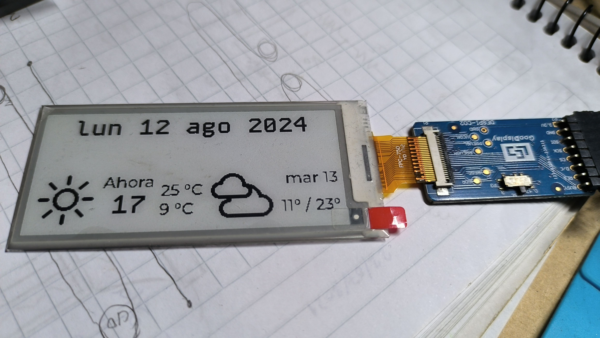

# minora wall clock 🕒
This project aims to upgrade an old personal project which originally was made using an ATMega328p running Arduino, an RTC module, an RH/T sensor, a 1602 LCD, and a (deformed) LED matrix arranged in a circular way, plus two handmade large 7-segment displays.

The goal of this upgrade is to use Zephyr on an ESP32 in order to (1) learn more about Zephyr and its ecosystem and (2) improve many aspects, such as BLE/WiFi timekeeping, indoor/outdoor weather conditions, and an e-ink display (EPD).

This project is still in early development. The first steps were to implement a minimal and working version of BLE+WiFi, which was more difficult than expected but is now already working (not much functionality, just connection tests), and to get the e-ink display working as desired.

## E-ink display 
I'm using the GDEM029E97 e-paper display from Good Display.

### SPI and GD example
The first attempt was to follow the same approach that I used previously in [this](https://github.com/jcontrerasf/E-ink-display-Zephyr) project, i.e., taking the example provided by Good Display and adapting it to use within Zephyr's SPI driver. This approach was used until  [commit 9455018](https://github.com/jcontrerasf/minora_ESP32/tree/94550187857a4897d6555475fc5d2e69bcb57fa8).

The big problem with this approach is that I need to manually convert every glyph into a bitmap and then into a C array. The advantage is that you can control exactly every command that you send to the display and choose to update it partially or completely.

### Zephyr display API and LVGL
Later, I started the "Zephyr-way" approach, i.e., describing the display in the devicetree file and using their APIs.

After many attempts and research, I finally got a working display using LVGL. This is the current state of the project:

## Important!
As I described in the file `src/forecast_json_defs.h`, I had to modify some functions of the Zephyr source code to parse the float values returned by the OpenMeteo API, since the Zephyr JSON implementation doesn't support floats. Please refer to the instructions in that file if you want to parse floats as well. Essentially, you just need to modify two functions: `decode_value()` and `get_elem_size()`.